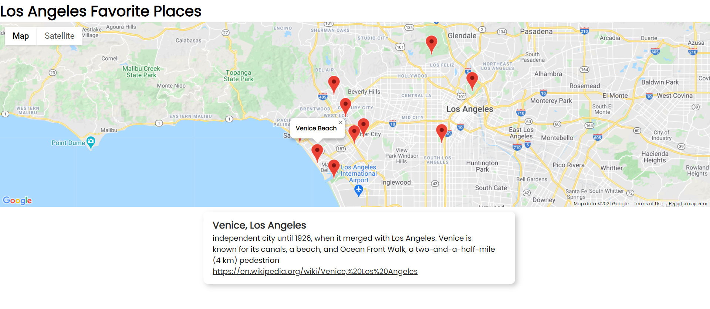
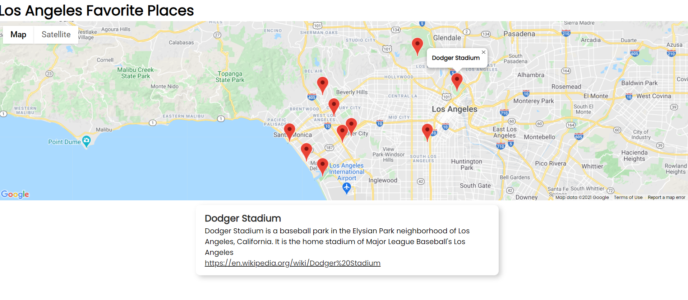

# LosAngeles_FavoritePlaces
A simple project that implements both the google maps API and Wikipedia API to show my favorite places in Los Angeles and to show the history of these places as well.
## Author: Kevin Delao

## Table of contents

* [Introduction](#intro)
* [General info](#general-info)
* [Technologies](#technologies)
* [Project Features](#project-features)
* [Setup](#setup)

## Introduction
This project was a fun way for me to gain experience with working with API's and to learn to manage API's with Javascript. Additionally, I always wanted to create a project where I could share some of my favorite places in Los Angeles. The project is straightforward in that it currently only has simple functionality. The project manually sets markers to 10 of my favorite places around LA and if you hover over the markers with the mouse cursor then the Wikipedia API will look up that location and display information about that location from wikipedia. In the future I plan to create an alternative version where the users location is asked and then the Google Maps API will set markers based on the most popular places around the users location.
## General info	
The project was created using Javascript and HTML where two JS files were created to seperate the functionality of Google Maps and Wikipedia. Index.html is the home display that will
show the map and the main.js file is in charge of producing the map and the markers. The wikisearch.js file holds the functions that use Wikipedia API and the functions themselves 
are called inside the main.js file.
## Technologies
Project was created using:
* Javascript
* Google Maps API
* Wikipedia API
* IDE: Visual Studio Code

## Project Features

### Google Maps display
The project is currently centered in Los Angeles and displays 10 different markers for various famous places in Los Angeles. Each marker is set based on the lattitude and
lolongitude of the location. Many of the UI elements from Google Maps were removed to 
make the maps display as simple as possible. The map is able to be dragged to see around the map, but the zoom and street view features were hidden for simplicity. The
zoom of the map is fixed at 11 to make it easy to all the markers at once.
 

### Hover Information
Each marker has an event associated with it when a mouse cursor hovers over it. When a cursor hovers over the marker a window with a name of the locations will be displayed.
Additionally, using the Wikipedia API the location will searched and the information from Wikipedia about the location will be displayed below the map. The information from Wikipedia
is shown as a brief summary and the link to the Wikipedia page can be accessed by clicking on the title card or clicking on ther underlined link.
 

## Setup
To run this project properly, it is reccomended to download the Go Live Server Extension from Visual Studio Code in order to easily run and create a server from the project. A Google Maps API key is also needed to properly run and display Google maps.
For information on how to obtain an API key and pricing options available (Google Maps is no longer free) follow the link below
 
<a href="https://developers.google.com/maps/documentation/javascript/overview">Google Maps API</a>
 
To learn how to use the Wikipedia API use the link below 
 
<a href="https://www.mediawiki.org/w/api.php">Wikipedia API</a>

